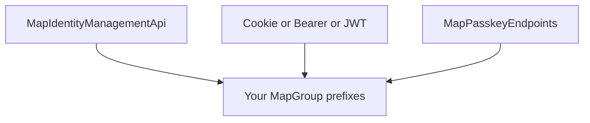

AuthEndpoints is designed as **composable minimal API modules**. Each facade is one composition. Advanced hosts assemble the same building blocks with custom paths and stacks.

## Core idea

1. **Management is separate from sign-in**
   - Lifecycle: `MapIdentityManagementApi`
   - Sign-in: compose **one** of `MapCookieAuthEndpoints` | `MapBearerAuthEndpoints` | `MapJwtAuthEndpoints`
2. **Optional passkeys** — `MapPasskeyEndpoints` on another (or the same) prefix
3. **Map onto `MapGroup(prefix)`** — paths are relative; hosts choose prefixes
4. **DI must match mapped modules** — register services before mapping routes
5. **Pipeline prerequisites** — rate limiting and antiforgery middleware for policies/CSRF to work

## Facades = named compositions

`MapAuthEndpoints` maps cookie sign-in:

- Management + cookie under `IdentityPath` (default `/identity`)
- Passkeys under `PasskeyPath` (default `/account`) when enabled
- JWT under `Jwt.Path` (default `/auth`) when enabled

`MapAuthEndpointsBearer` maps the same management, passkey, and optional JWT groups, with Identity bearer login and refresh instead of cookie login.

## Next

- [Requirements](/composables/requirements) — DI, pipeline, antiforgery, rate limits
- [Recipes](/composables/recipes) — cookie web, bearer, JWT-only, custom paths
