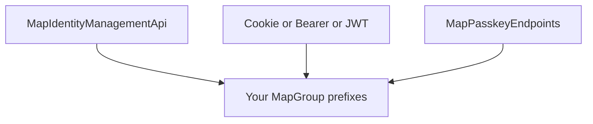

AuthEndpoints is designed as **composable minimal API modules**. Each facade is one composition. Advanced hosts assemble the same building blocks with custom paths and stacks. `MapIdentityApi` maps one fixed set: [MapIdentityApi alternative](/concepts/mapidentityapi-alternative).

## Core idea

1. **Management is separate from sign-in**
   - Lifecycle: `MapIdentityManagementApi`
   - Sign-in: compose **one** of `MapCookieAuthEndpoints` | `MapBearerAuthEndpoints` | `MapJwtAuthEndpoints`
2. **Optional passkeys** — `MapPasskeyEndpoints` on another (or the same) prefix
3. **Map onto `MapGroup(prefix)`** — paths are relative; hosts choose prefixes
4. **DI must match mapped modules** — register services before mapping routes
5. **Pipeline prerequisites** — rate limiting and antiforgery middleware for policies/CSRF to work

## Facade = one composition

`MapAuthEndpoints` maps:

- Management plus cookie or Identity bearer sign-in under `IdentityPath` (default `/identity`), from `AuthEndpointsOptions.SignIn`
- Passkeys under `PasskeyPath` (default `/account`) when enabled
- JWT under `Jwt.Path` (default `/auth`) when enabled

## Next

- [Composition requirements](/composables/requirements): DI, pipeline, antiforgery, and rate limits.
- [Compose a custom auth stack](/composables/recipes): cookie web, Identity bearer, JWT-only, and custom paths.
- [Choose a sign-in stack](/getting-started/choose-a-sign-in-stack): which stack fits which client.
